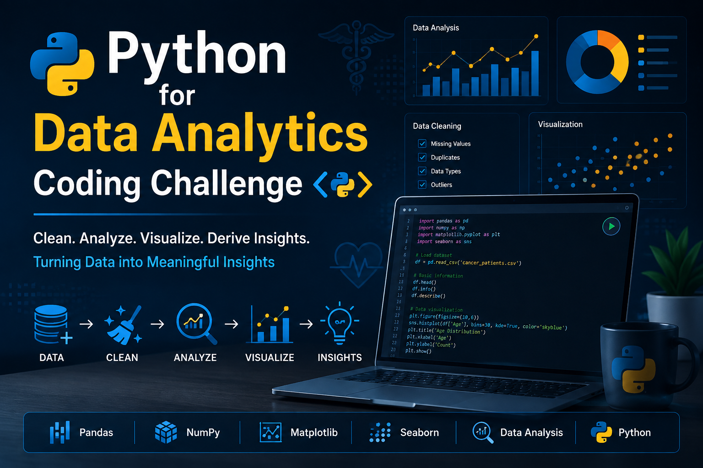

  

 

  
  
  
  
  

  
  
  
  
  
  

 

---

## 📌 Overview
This repository contains my Python for Data Analytics coding challenge practice using a Cancer Patients dataset. The objective of this challenge was to apply Python programming and data analytics techniques to clean, preprocess, analyze, and visualize healthcare data to extract meaningful insights.

## 🎯 Objectives
- Perform data cleaning and preprocessing on the Cancer Patients dataset.
- Handle missing values using appropriate imputation techniques.
- Convert and standardize date columns for accurate analysis.
- Conduct Exploratory Data Analysis (EDA) to identify patterns and trends.
- Create informative visualizations to summarize key findings.
- Generate meaningful healthcare insights from the analyzed data.

## 🛠️ Tools & Libraries
- Python
- Pandas
- NumPy
- Matplotlib
- Seaborn

## 📂 Repository Contents
- Python_For_DA_coding_Challenge.ipynb – Jupyter Notebook containing the complete coding challenge solution.
- _cancer_dataset_uae.csv – Raw dataset used for the analysis.

## 📊 Key Tasks Performed
- Imported and explored the dataset.
- Cleaned and preprocessed the data.
- Handled missing values.
- Converted date columns into datetime format.
- Performed feature engineering.
- Conducted Exploratory Data Analysis (EDA).
- Created data visualizations.
- Generated insights based on the analysis.

## 📈 Outcome
This coding challenge strengthened my practical skills in Python for Data Analytics, including data preprocessing, data analysis, visualization, and extracting actionable insights from healthcare data.

